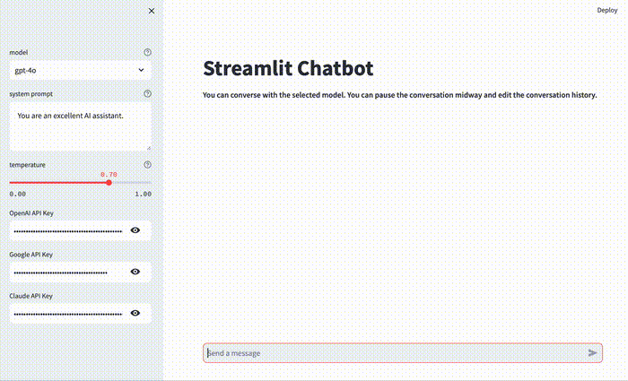

# streamlit-chatbot

[app](https://app-chatbot-umvnjxndkxd3yjkbgh2s7y.streamlit.app)

[demo app](https://app-chatbot-ru3ucidcgappbnsh2ss3n7v.streamlit.app)

**This chatbot aims to recreate the ChatGPT browser app using Streamlit.**

It supports

- **interrupting generation mid-way**
- **editing conversation history**
- **streaming output**
- **setting system prompts**
- **adjusting the temperature**
- **by configuring the API, you can use models from OpenAI, Anthropic, and Google.**

A demo app is available which provides predetermined outputs instead of live AI interactions. This should give you an idea of the user experience.

