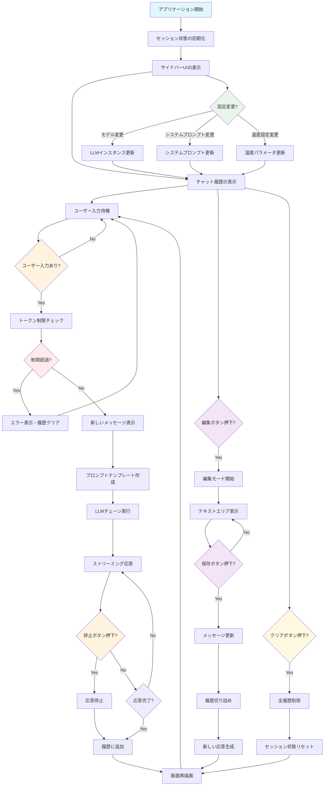

# Streamlit Chatbot Flow

## 主要なコンポーネント

### セッション状態管理
- `chat_history`: 会話履歴
- `edit_states`: 編集状態の管理
- `total_tokens`: トークン使用量
- `llm`: 現在のLLMインスタンス
- `system_prompt`: システムプロンプト
- `temperature`: 温度設定

### 主要な処理フロー

1. **初期化**: セッション状態の設定、デフォルトLLMの設定
2. **UI表示**: サイドバーとメインチャット画面の描画
3. **ユーザー入力処理**: 入力検証、トークン制限チェック
4. **AI応答生成**: LangChainを使用したストリーミング応答
5. **履歴管理**: メッセージの追加、編集、削除
6. **設定変更**: モデル切り替え、パラメータ調整

### 特殊機能

- **メッセージ編集**: 任意のメッセージを編集し、以降の履歴を再生成
- **応答中断**: ストリーミング中に応答を停止可能
- **トークン管理**: 50,000トークン制限での自動履歴クリア
- **マルチモデル対応**: OpenAI、Anthropic、Google の3つのAIプロバイダー